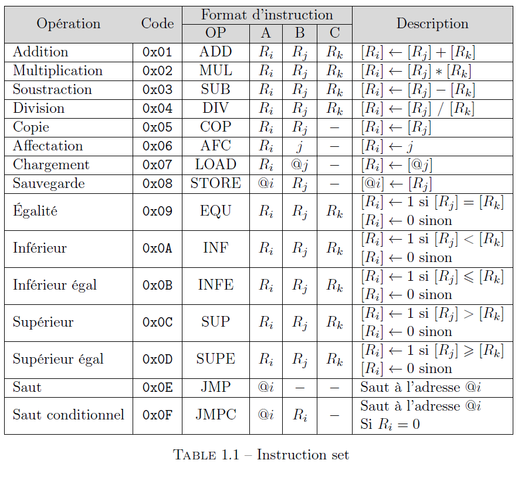

# Développement de l’interpréteur d’un langage assembleur




## TODO

Difference registres valeurs ?

- ADD value ```2``` to register ```R0```

```
ADD 0 2
```

- LOAD register ```2``` to register ```R0```

```
ADD 0 2
```

=> confusion
